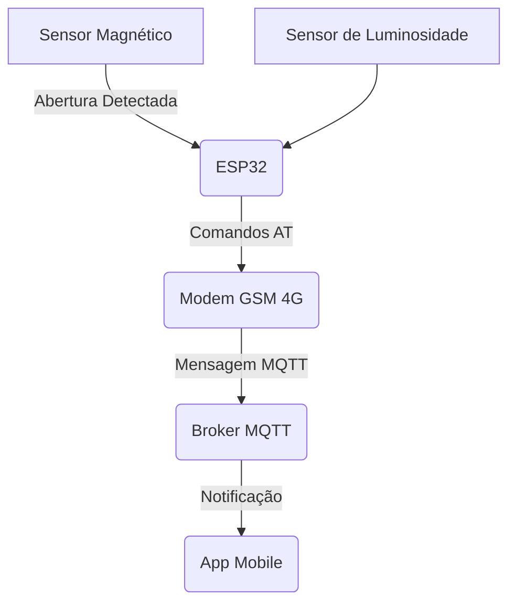

# 🌾 Sistema de Alarme Rural com IoT, ESP32 e GSM 4G

---

## 📘 Sobre o Projeto

Este repositório apresenta o desenvolvimento de um **sistema de alarme de segurança para áreas rurais**, criado como parte de um Trabalho de Conclusão de Curso (TCC).  
O sistema foi projetado especialmente para regiões com:

- ❌ baixa infraestrutura de internet cabeada  
- ❌ acesso limitado à rede elétrica  
- ✔ sinal de telefonia móvel disponível  

O objetivo é fornecer uma solução **acessível**, **confiável** e **inovadora** utilizando tecnologias da **Internet das Coisas (IoT)**.

---

## 🚜 Motivação

Este projeto nasceu a partir de um caso real ocorrido em uma **reserva de floresta natural no município de Simão Dias, Sergipe**, onde um apiário tem sido alvo de furtos recorrentes, causando prejuízos ao apicultor responsável.

De acordo com a Anatel (2023a), cerca de **80,70% dos moradores de Simão Dias possuem cobertura 4G**, o que torna a região adequada para o uso de tecnologias de comunicação móvel. Considerando:

- A localização do apiário  
- As imagens e análises apresentadas no Capítulo 3 da monografia  
- Os recursos tecnológicos disponíveis na área de **IoT aplicada ao agronegócio**  
- A presença de sinal de telefonia móvel  

o desenvolvimento de um **sistema de alarme inteligente** surge como uma solução promissora para **mitigar furtos e aumentar a segurança** no ambiente rural.

Embora baseado nesse caso específico, o sistema **não se limita a apiários**.  
A solução pode ser aplicada em diversas outras áreas rurais que disponham de **infraestrutura mínima de comunicação sem fio**, tornando-se um recurso versátil para diferentes cenários do campo.

---

## ⚙️ Tecnologias e Componentes Utilizados

| Componente / Tecnologia | Função |
|-------------------------|--------|
| **ESP32**               | Microcontrolador principal |
| **Modem GSM 4G**        | Comunicação via rede móvel (comandos AT) |
| **Protocolo MQTT**      | Envio das mensagens de alerta |
| **Sensor de Luminosidade** | Auxílio em cenários de intrusão |
| **Sensor Magnético (Reed Switch)** | Detecção de abertura/violação |
| **Aplicativo Móvel**    | Recebe notificações sonoras |

---

## 🧩 Arquitetura Geral do Sistema

---
## 📄 Mais Informações

Para detalhes completos sobre o desenvolvimento, metodologia, testes e fundamentação teórica, acesse a **monografia em PDF** disponível neste repositório:

👉 **[TCC - Gideval de Jesus Santos (PDF)](./TCC2%20-%20Gideval%20de%20Jesus%20Santos.pdf)** # BeeNotify - Sistema de Alarme para áreas onde a rede elétrica e a internet cabeada são escassas
